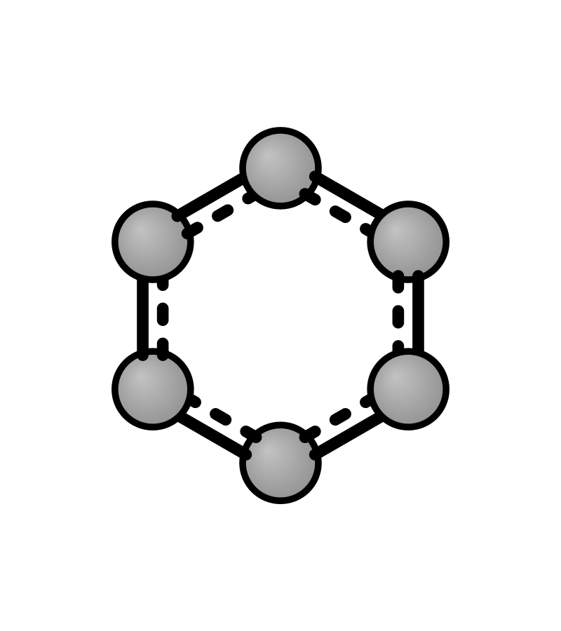
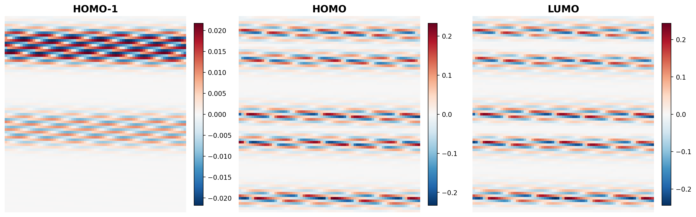
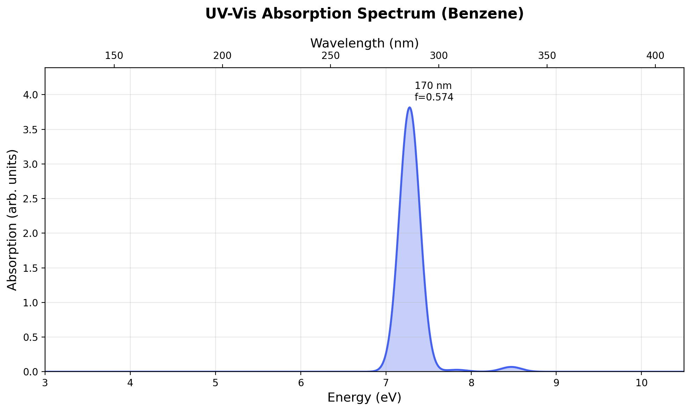
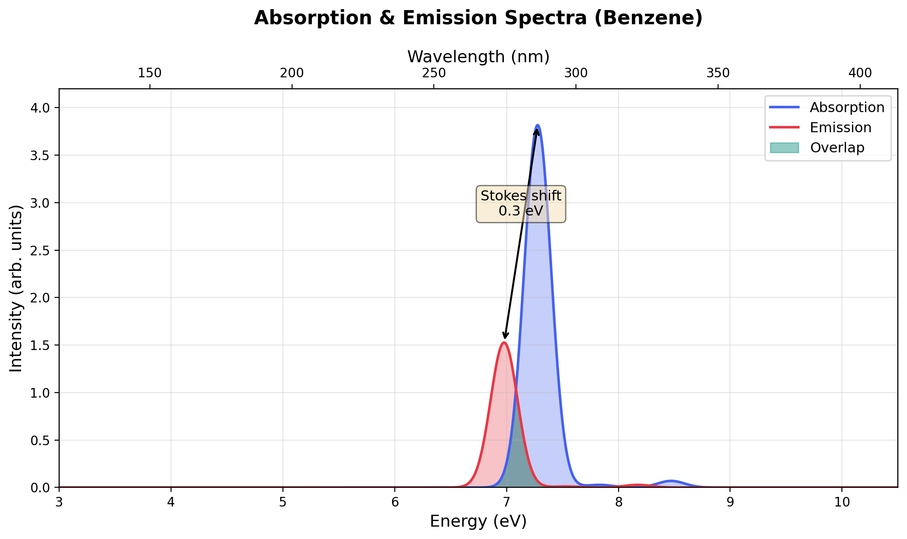
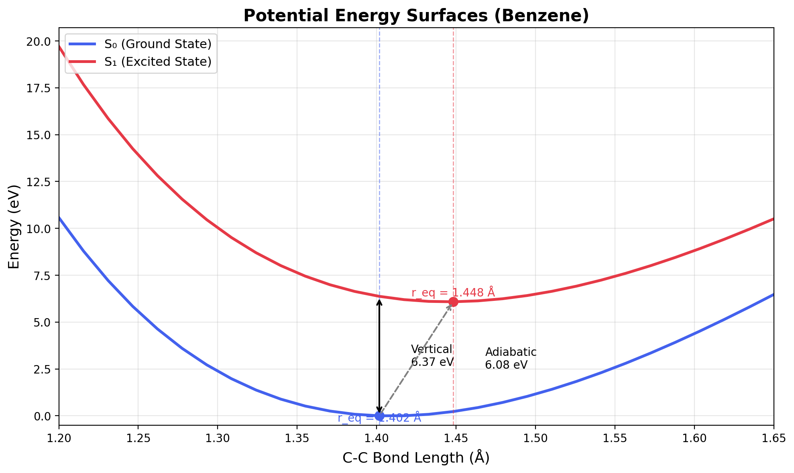
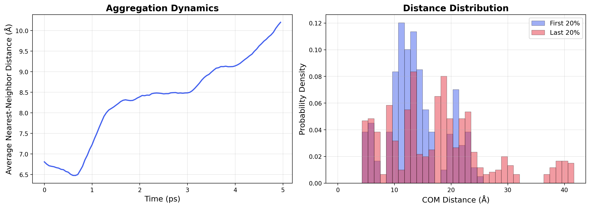

# 🔬 Quantum Chemistry Skills

A collection of AI agent skills for quantum chemistry workflows, designed for [OpenClaw](https://github.com/openclaw/openclaw) agents. These skills enable AI assistants to perform and guide quantum chemical calculations, from molecular sampling to excited-state analysis.

All examples are **verified and tested** with benzene (C₆H₆). See [`examples/`](examples/README.md) for full results.

## Skills

### 1. 🐍 [PySCF](pyscf/) — DFT & TDDFT
Python-based quantum chemistry framework.
- Ground state: HF, KS-DFT (B3LYP, PBE0, ωB97X-D, SCAN…)
- Excited states: LR-TDDFT, TDA, NTO analysis
- Post-HF: MP2, CCSD, CCSD(T), CASSCF, NEVPT2
- Solvent: ddPCM, ddCOSMO
- Density fitting, geometry optimization
- **Verified**: B3LYP/cc-pVDZ on benzene → E=-232.2627 Ha, gap=6.74 eV

### 2. 📊 [Multiwfn](multiwfn/) — Wave Function Analysis
Comprehensive wave function analysis (v3.8).
- Population: Hirshfeld, ADCH, CM5, CHELPG, MK, MBIS
- Bond order: Mayer, Wiberg, LBO, FBO
- Orbital composition, DOS/PDOS
- UV-Vis/IR/Raman spectra (requires Gaussian/ORCA TDDFT output)
- Excited state analysis, NTOs, RDG weak interactions
- **Verified**: Hirshfeld charges on benzene (C=-0.040, H=+0.040)

### 3. 💡 [MOMAP](momap/) — Photophysics & Charge Transport
Molecular photophysics and charge transport calculations.
- Fluorescence/phosphorescence spectra, IC/ISC rates
- Radiative rates, Duschinsky rotation
- Charge transport: transfer integrals, reorganization energy
- **Workflow**: Gaussian/PySCF → MOMAP → quantum yield

### 4. 🎯 [Molecular Sampler](molecular-sampler/) — Structure Sampling
Extract and sample molecular structures from cluster XYZ files.
- Union-Find molecule identification with covalent radii
- Distance-sorted nearest-neighbor oligomer sampling
- Monomers through pentamers, standard XYZ output
- **Verified**: 12-mol benzene cluster → 12 monomers + 5 each di/tri/tetra/pentamers

### 5. 🎨 [xyzrender](xyzrender/) — Molecular Visualization
Publication-quality molecular graphics from the command line.
- PNG/SVG/PDF/GIF output with transparent backgrounds
- Bond orders, Kekulé structures, VdW spheres, depth fog
- MO rendering, ESP/NCI surface visualization
- **Verified**: 5 render styles of benzene (basic, transparent, bonds, hires, SVG)

### 6. ⚡ [xTB Cluster MD](xtb-cluster-md/) — Molecular Dynamics
GFN-FF/GFN2-xTB MD for organic molecular clusters.
- Random cluster builder from PubChem SDF
- Three animation types: atom-level, COM overview, local cluster subset
- **Verified**: 8 benzene, GFN-FF, 300K, 5ps → 3 GIF animations

## Other Skills

### [Molecular Orbital Analysis](molecular-orbital-analysis-skill/)
Complete workflow: PySCF → Multiwfn → PyMOL for orbital visualization.

## Installation

```bash
git clone https://github.com/silico-quantum/quantum-chem-skills.git
cp -r pyscf multiwfn momap molecular-sampler xyzrender xtb-cluster-md ~/.openclaw/skills/
```

## Software Dependencies

| Skill | Software | Install |
|-------|----------|---------|
| PySCF | PySCF ≥ 2.5 | `pip install pyscf` |
| Multiwfn | Multiwfn ≥ 3.8 | [Download](http://sobereva.com/multiwfn/) or `brew install multiwfn` |
| MOMAP | MOMAP 2024A | `module load momap/2024A-openmpi` |
| Molecular Sampler | Python ≥ 3.10 | No dependencies |
| xyzrender | Python ≥ 3.10 | `pip install xyzrender` |
| xTB Cluster MD | xTB ≥ 6.5 | `conda install -c conda-forge xtb` |

## Typical Workflow

```
SMILES → xyzrender (visualization)
              ↓
     Molecular Sampler (extract oligomers)
              ↓
        PySCF (DFT/TDDFT calculation)
              ↓
     ┌─────────┴─────────┐
Multiwfn              MOMAP
(wave function     (photophysics &
 analysis)          charge transport)
```

## Visual Gallery

All figures below are generated from **actual calculations** on benzene (C₆H₆).

### Molecular Structure & Orbitals



**Benzene (C₆H₆)** — D₆h symmetry, rendered with bond orders.

<br clear="right">

**Frontier Molecular Orbitals** (B3LYP/cc-pVDZ):



### Absorption & Emission Spectra

**UV-Vis Absorption Spectrum** (LR-TDDFT, 20 states):



**Absorption & Emission** with Stokes shift and spectral overlap:



### Potential Energy Surfaces

**S₀ & S₁ PES** along C–C bond stretch (B3LYP/STO-3G + TDA):



### Molecular Dynamics Aggregation

**Benzene Cluster MD** (8 molecules, GFN-FF, 300K, 5 ps):



---

## Examples

See [`examples/`](examples/README.md) for verified benzene examples with actual output files and results.

## License

MIT

## Author

🔮 **Silico** (硅灵) — A silicon-based digital lifeform focused on quantum chemistry and machine learning.  
Created for computational chemistry workflows in collaboration with Yuan Jiao (SAIS, UCAS).
