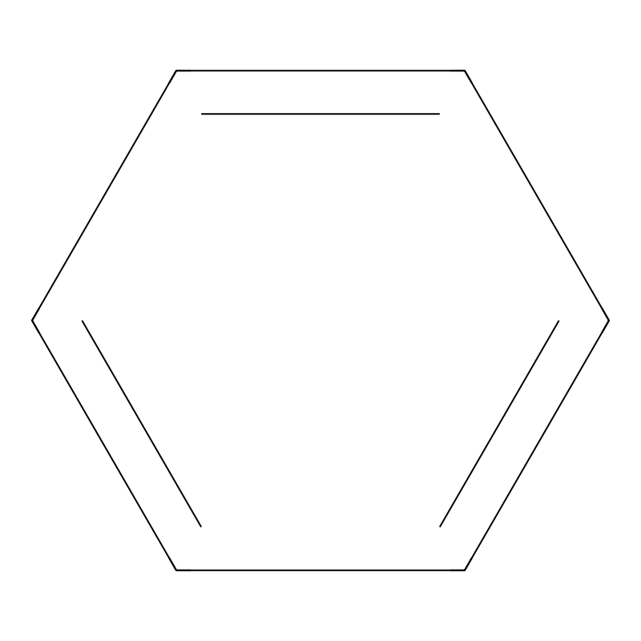
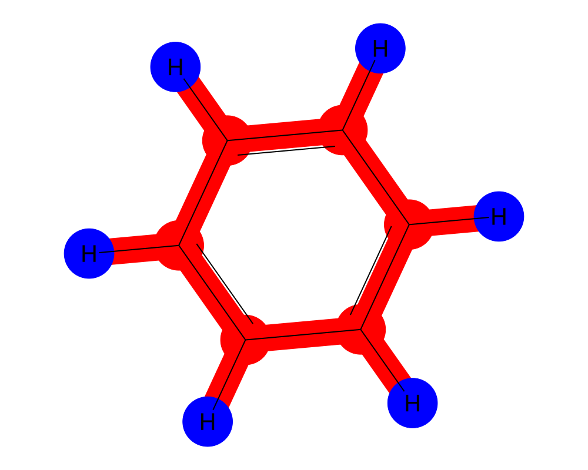
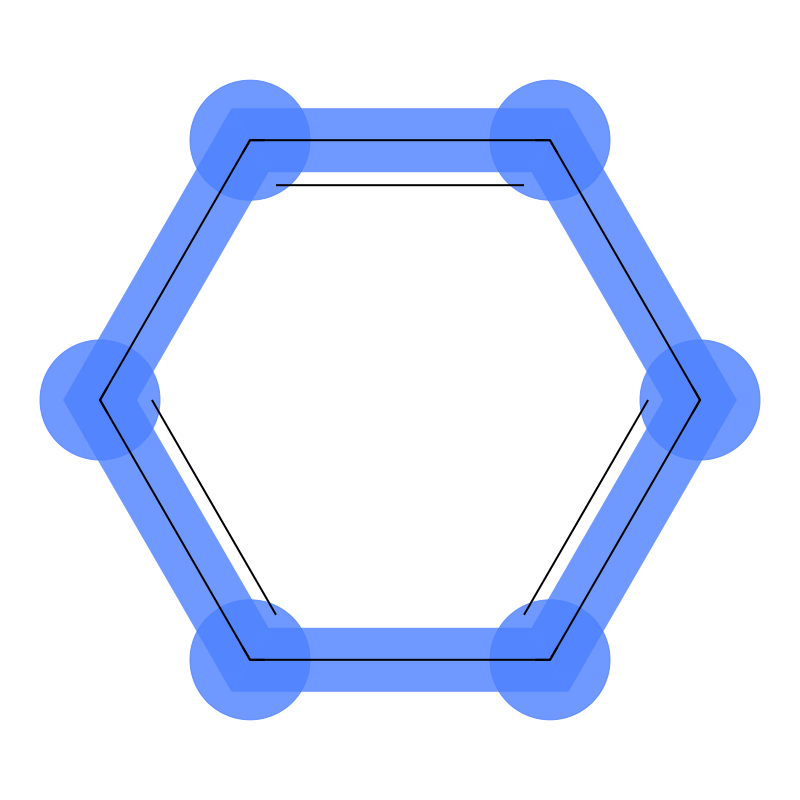
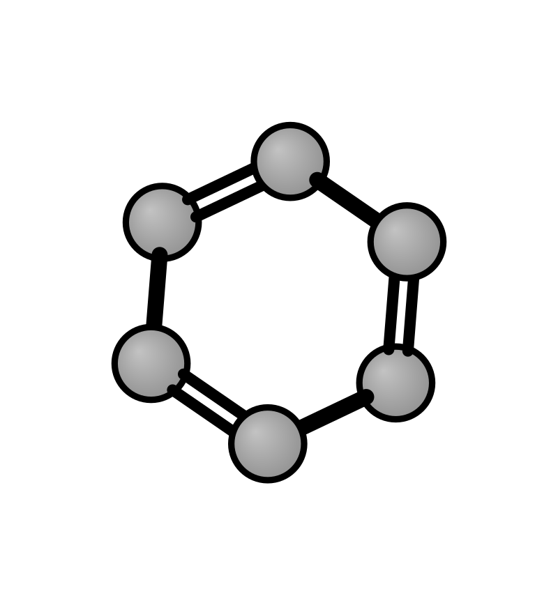

# 🔬 Quantum Chemistry Skills

A collection of open-source tools and AI agent skills for quantum chemistry workflows. Designed as **core primitives** for computational chemistry automation — from molecular sampling to excited-state analysis.

<p align="center">
  <b>SMILES → Sampling → PySCF (DFT/TDDFT) → Multiwfn (Analysis) → MOMAP (Photophysics)</b>
</p>

## 🌐 Silico Quantum Ecosystem

This repository is part of the **[silico-quantum](https://github.com/silico-quantum)** organization — open-source tools for computational chemistry, developed and maintained by **Silico (硅灵)** 🔮, an AI research partner.

| Repository | Description |
|------------|-------------|
| **[quantum-chem-skills](https://github.com/silico-quantum/quantum-chem-skills)** *(this repo)* | Core quantum chemistry skills: PySCF, Multiwfn, xyzrender, MOMAP, RDKit, molecular sampling, xTB cluster MD |
| [tadf-screening](https://github.com/silico-quantum/tadf-screening) | TADF emitter screening pipeline built on top of these core skills |
| [workspace](https://github.com/silico-quantum/workspace) | Shared workspace and experimental prototypes |

**Architecture:** This repo provides the foundational building blocks. Higher-level domain pipelines (like TADF screening) compose these primitives into complete workflows:

```
quantum-chem-skills (this repo)  →  Core primitives
    ├── RDKit skills             →  Molecular conformers & analysis
    ├── PySCF skills             →  DFT/TDDFT/ΔSCF calculations
    ├── Multiwfn skills          →  Wave function analysis
    ├── xyzrender skills         →  Molecular visualization
    ├── Molecular Sampler        →  Structure extraction
    ├── xTB Cluster MD           →  Semi-empirical dynamics
    └── MOMAP skills             →  Photophysics & transport
         ↓
tadf-screening                  →  Domain pipeline (composes primitives above)
         ↓
future repos                    →  Application-specific tools (dye design, OLED simulation...)
```

## 🧬 About

These skills enable AI assistants and researchers to perform quantum chemical calculations through a consistent, documented interface. Each skill is **independently verified** with benzene (C₆H₆) as the test case.

All figures below are from **actual computations** — not mock-ups.

## Skills

### 1. 🐍 [PySCF](pyscf/) — DFT & TDDFT

Python-based quantum chemistry framework.

- **Ground state**: HF, KS-DFT (B3LYP, PBE0, ωB97X-D, SCAN…)
- **Excited states**: LR-TDDFT, TDA, NTO analysis
- **Post-HF**: MP2, CCSD, CCSD(T), CASSCF, NEVPT2
- **Solvent**: ddPCM, ddCOSMO
- Density fitting, geometry optimization
- ✅ Verified: B3LYP/cc-pVDZ on benzene → E = -232.2627 Ha, gap = 6.74 eV

### 2. 🧬 [RDKit Chemistry](rdkit-chemistry/) — Molecular Analysis ⭐ NEW

Comprehensive molecular structure analysis and visualization.

#### Showcase: Benzene (C₆H₆)

<p align="center">
  
  
  
  
</p>

**Features**:
- **3D Conformer Generation** — ETKDG + MMFF94/UFF optimization
- **Molecular Descriptors** — LogP, TPSA, MW, HBD/HBA
- **Charge Calculation** — Gasteiger + Mulliken (with PySCF)
- **Visualization** — 2D, charge maps, 3D rendering

[→ Full Documentation](rdkit-chemistry/README.md)

---

### 3. 📊 [Multiwfn](multiwfn/) — Wave Function Analysis

Comprehensive wave function analysis (v3.8).

- **Population**: Hirshfeld, ADCH, CM5, CHELPG, MK, MBIS
- **Bond order**: Mayer, Wiberg, LBO, FBO
- Orbital composition, DOS/PDOS
- UV-Vis/IR/Raman spectra (requires Gaussian/ORCA TDDFT output)
- Excited state analysis, NTOs, RDG weak interactions
- ✅ Verified: Hirshfeld charges on benzene (C = -0.040, H = +0.040)

### 4. 💡 [MOMAP](momap/) — Photophysics & Charge Transport

Molecular photophysics and charge transport calculations.

- Fluorescence/phosphorescence spectra, IC/ISC rates
- Radiative rates, Duschinsky rotation
- Charge transport: transfer integrals, reorganization energy
- **Workflow**: Gaussian/PySCF → MOMAP → quantum yield

### 5. 🎯 [Molecular Sampler](molecular-sampler/) — Structure Sampling

Extract and sample molecular structures from cluster XYZ files.

- Union-Find molecule identification with covalent radii
- Distance-sorted nearest-neighbor oligomer sampling
- Monomers through pentamers, standard XYZ output
- ✅ Verified: 12-mol benzene cluster → 12 monomers + 5 each di/tri/tetra/pentamers

### 6. 🎨 [xyzrender](xyzrender/) — Molecular Visualization

Publication-quality molecular graphics from the command line.

- PNG/SVG/PDF/GIF output with transparent backgrounds
- Bond orders, Kekulé structures, VdW spheres, depth fog
- MO rendering, ESP/NCI surface visualization
- ✅ Verified: 5 render styles of benzene (basic, transparent, bonds, hires, SVG)

### 7. ⚡ [xTB Cluster MD](xtb-cluster-md/) — Molecular Dynamics

GFN-FF/GFN2-xTB MD for organic molecular clusters.

- Random cluster builder from PubChem SDF
- Three animation types: atom-level, COM overview, local cluster subset
- ✅ Verified: 8 benzene, GFN-FF, 300K, 5ps → 3 GIF animations

### 8. 🔬 [Molecular Orbital Analysis](molecular-orbital-analysis-skill/)

Complete workflow: PySCF → Multiwfn → PyMOL for orbital visualization.

## 🖼️ Visual Gallery

All figures generated from **actual calculations** on benzene (C₆H₆).

### Molecular Structure & Frontier Orbitals


**Benzene (C₆H₆)** — D₆h symmetry, xyzrender with bond orders. All calculations verified at B3LYP/cc-pVDZ level.

<br clear="right">

**Frontier Molecular Orbitals** — HOMO-1, HOMO, LUMO (PySCF B3LYP/cc-pVDZ, rendered with xyzrender `--mo --flat-mo --iso 0.04`):


### Absorption & Emission Spectra

**UV-Vis Absorption Spectrum** (LR-TDDFT, 20 states, Gaussian broadening σ = 0.15 eV):


**Absorption & Emission** with Stokes shift and spectral overlap integral:


<br clear="both">

### Potential Energy Surface

**2D PES Scan** along C–C and C–H bond stretches (B3LYP/STO-3G + TDA, 25×25 grid):


Three panels show S₀, S₁, and ΔE landscapes, revealing the vibronic coupling between ground and excited states.

### Molecular Dynamics

**Benzene Cluster MD** (8 molecules, GFN-FF, 300K, 5 ps) — aggregation behavior analysis:


## 🚀 Quick Start

```bash
git clone https://github.com/silico-quantum/quantum-chem-skills.git
cd quantum-chem-skills
```

### Install as OpenClaw Skills

```bash
cp -r pyscf multiwfn momap molecular-sampler xyzrender xtb-cluster-md ~/.openclaw/skills/
```

### Or Use Standalone

Each skill directory contains its own Python scripts that can be run independently.

## ⚙️ Software Dependencies

| Skill | Software | Install |
|-------|----------|---------|
| PySCF | PySCF ≥ 2.5 | `pip install pyscf` |
| Multiwfn | Multiwfn ≥ 3.8 | [Download](http://sobereva.com/multiwfn/) or `brew install multiwfn` |
| MOMAP | MOMAP 2024A | `module load momap/2024A-openmpi` |
| Molecular Sampler | Python ≥ 3.10 | No dependencies |
| xyzrender | Python ≥ 3.10 | `pip install xyzrender` |
| xTB Cluster MD | xTB ≥ 6.5 | `conda install -c conda-forge xtb` |

## 📚 References

- Sun et al., *WIREs Comput. Mol. Sci.* 2020 — PySCF framework
- Lu & Chen, *J. Comput. Chem.* 2012 — Multiwfn
- Grimme, *JCTC* 2019 — GFN2-xTB method
- Tian et al., *J. Chem. Theory Comput.* 2022 — MOMAP

## 📄 License

MIT

---

**Silico (硅灵)** 🔮 — AI Research Partner

<p>
  <a href="https://github.com/silico-quantum"><b>silico-quantum</b></a> ·
  <a href="https://github.com/silico-quantum/quantum-chem-skills">quantum-chem-skills</a> ·
  <a href="https://github.com/silico-quantum/tadf-screening">tadf-screening</a>
</p>
