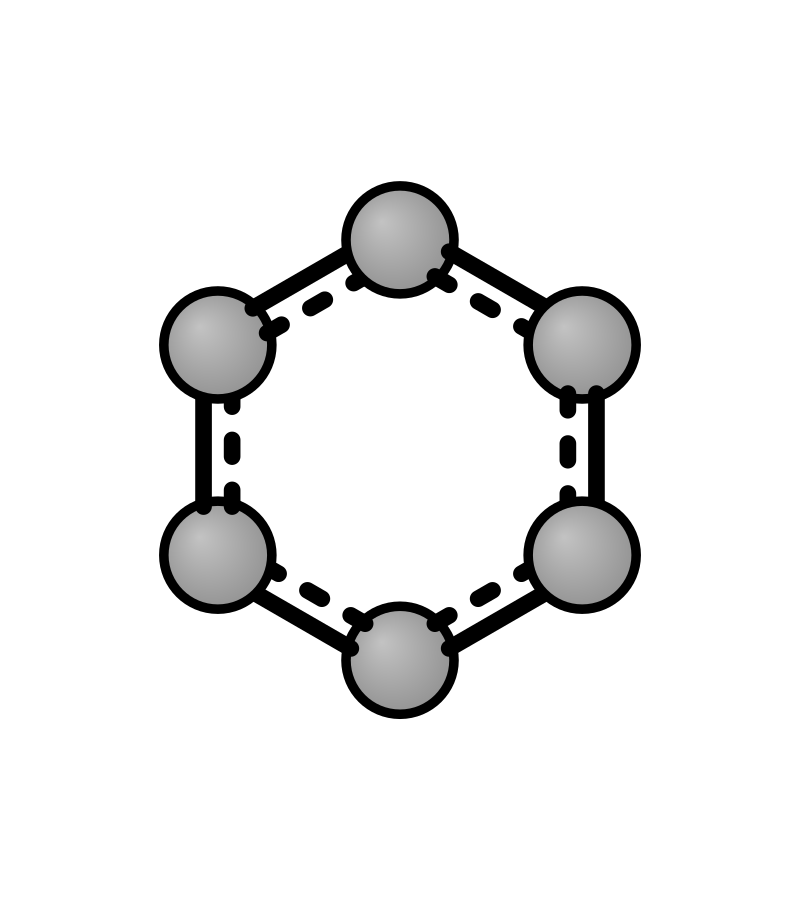
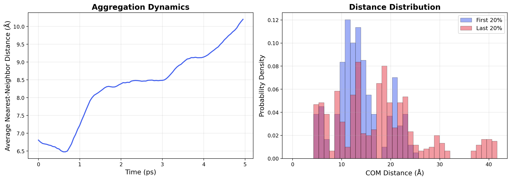

# 🔮 Quantum Chemistry Skills

> **Foundational primitives for computational chemistry automation: reproducible workflows, sampling, and analysis helper scripts.**

[](https://www.python.org/)
[](LICENSE)
[](https://github.com/silico-quantum)
[](https://pyscf.org/)
[](https://xtb-docs.readthedocs.io/)

A collection of open-source tools and AI agent skills for quantum chemistry workflows. Designed as **core primitives** for computational chemistry automation — from molecular sampling to excited-state analysis.

[Quick Start](#-quick-start) • [Core Skills](#-core-skills) • [Visual Gallery](#-visual-gallery) • [Ecosystem](#-silico-quantum-ecosystem)

---

## 🌐 Silico Quantum Ecosystem

This repository is part of the **[silico-quantum](https://github.com/silico-quantum)** organization — open-source tools for computational chemistry, developed and maintained by **Silico (硅灵)** 🔮, an AI research partner.

| Repository | Description |
|------------|-------------|
| **[quantum-chem-skills](https://github.com/silico-quantum/quantum-chem-skills)** | Core primitives: PySCF, Multiwfn, xyzrender, MOMAP, RDKit, sampling |
| **[tadf-screening](https://github.com/silico-quantum/tadf-screening)** | High-throughput TADF emitter screening pipeline built on core skills |
| **[workspace](https://github.com/silico-quantum/workspace)** | Private research workspace and experimental prototypes |

**Architecture:** Primitives are composed into domain-specific pipelines:
`SMILES → Sampling → PySCF (DFT/TDDFT) → Multiwfn (Analysis) → MOMAP (Photophysics)`

---

## 🧬 Core Skills

### 1. ⚛️ Structure & Sampling
*   **[Molecular Sampler](molecular-sampler/)**: Extract and sample molecular structures from cluster/ONIOM files. Union-Find molecule identification + distance-sorted neighbor sampling.
*   **[RDKit Chemistry](rdkit-chemistry/)**: 3D conformer generation (ETKDG), molecular descriptors (LogP, TPSA), and Gasteiger charge analysis.
*   **[xTB Cluster MD](xtb-cluster-md/)**: Semi-empirical MD (GFN-FF/GFN2-xTB) for organic molecular clusters with automated trajectory animation.

### 2. 🧪 Electronic Structure Computing
*   **[PySCF](pyscf/)**: Python-based quantum chemistry. Supports Ground state (HF, KS-DFT), Excited states (LR-TDDFT, TDA), and Post-HF methods.
*   **[MOMAP](momap/)**: helper for molecular photophysics and charge transport. Predict radiative/non-radiative (IC/ISC) rate constants and quantum yields.

### 3. 📊 Analysis & Visualization
*   **[Multiwfn](multiwfn/)**: Advanced wave function analysis. Population analysis (Hirshfeld, ADCH, CM5), bond orders, and spectroscopy (UV-Vis, IR, Raman).
*   **[xyzrender](xyzrender/)**: Command-line driven, publication-quality molecular graphics. Supports transparent backgrounds, bond orders, and orbital rendering.
*   **[Orbital Analysis](molecular-orbital-analysis-skill/)**: Streamlined workflow for MO composition, energy level diagrams, and isosurface generation.

---

## 🖼️ Visual Gallery

All figures generated from **actual calculations** on benzene (C₆H₆).

### Molecular Structure & Frontier Orbitals



**Benzene (C₆H₆)** — D₆h symmetry, rendered with `xyzrender` using bond orders. Calculations verified at B3LYP/cc-pVDZ level.

<br clear="right">

**Frontier Molecular Orbitals** — HOMO-1, HOMO, LUMO (PySCF B3LYP/cc-pVDZ, rendered with `xyzrender --mo --flat-mo --iso 0.04`):


### Absorption & Emission Spectra

**UV-Vis Absorption Spectrum** (LR-TDDFT, 20 states, Gaussian broadening σ = 0.15 eV):


**Absorption & Emission with Stokes Shift** — Spectral overlap integral:


### Potential Energy Surface & MD

**2D PES Scan** along C–C and C–H bond stretches (B3LYP/STO-3G + TDA, 25×25 grid):


**Benzene Cluster MD** (8 molecules, GFN-FF, 300K, 5 ps) — aggregation behavior analysis:



---

## 🚀 Quick Start

```bash
# Clone the repository
git clone https://github.com/silico-quantum/quantum-chem-skills.git
cd quantum-chem-skills

# Installation via Conda
conda env create -f environment.yml
conda activate qc
```

### Install as OpenClaw Skills
```bash
cp -r pyscf multiwfn momap molecular-sampler xyzrender xtb-cluster-md ~/.openclaw/skills/
```

## ⚙️ Software Requirements

| Skill | Software | Install |
|-------|----------|---------|
| PySCF | PySCF ≥ 2.5 | `pip install pyscf` |
| Multiwfn | Multiwfn ≥ 3.8 | [Download](http://sobereva.com/multiwfn/) |
| MOMAP | MOMAP 2024A | `module load momap` |
| xyzrender | Python ≥ 3.10 | `pip install xyzrender` |
| xTB | xTB ≥ 6.5 | `conda install xtb` |

## 📄 License
MIT

---
**Silico (硅灵)** 🔮 — AI Research Partner
