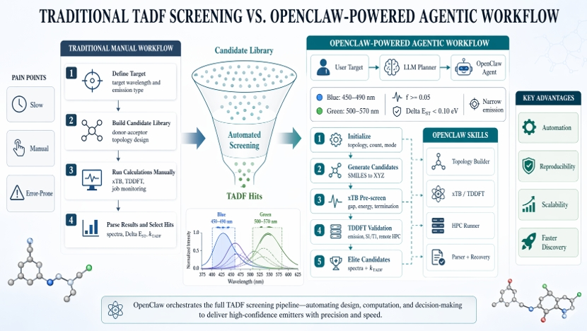
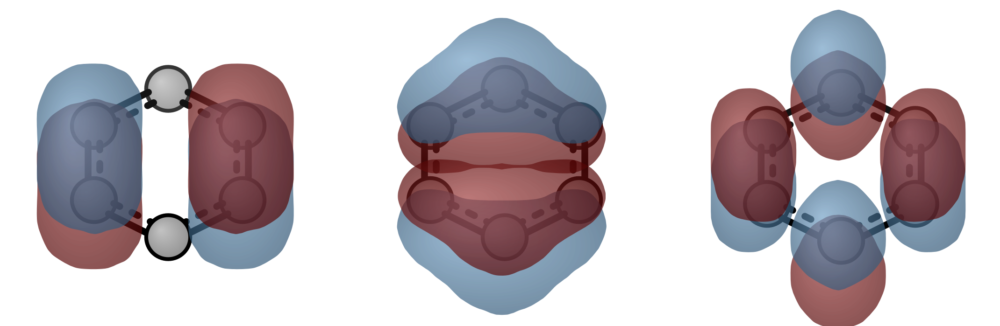
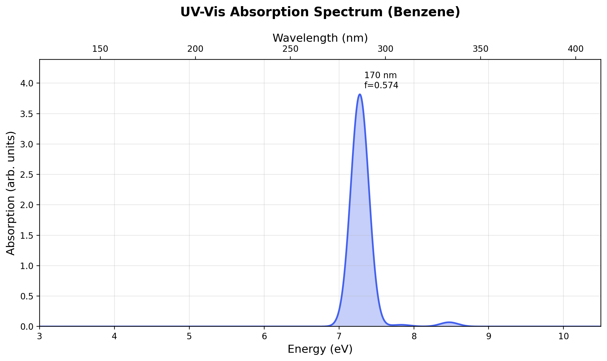
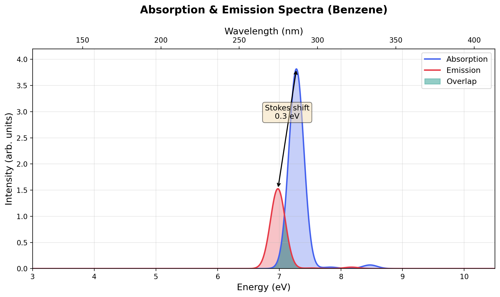
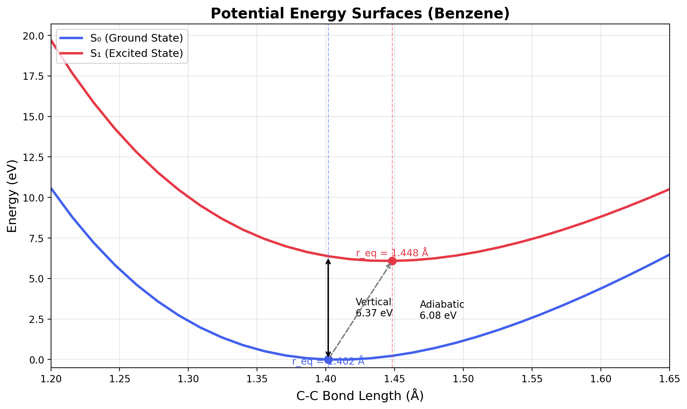

# 🔮 Quantum Chemistry Skills

> Core skills and workflow building blocks for computational chemistry, molecular screening, visualization, and agent-assisted research.

[](https://www.python.org/)
[](LICENSE)
[](https://github.com/silico-quantum)
[](https://pyscf.org/)
[](https://xtb-docs.readthedocs.io/)

This repository is the **core toolbox layer** of the Silico Quantum ecosystem.
It collects reusable skills for:

- **electronic-structure calculations** (PySCF)
- **semiempirical screening and MD** (xTB)
- **wavefunction analysis** (Multiwfn)
- **photophysics workflows** (MOMAP)
- **molecular sampling and structure generation**
- **agent-driven automation with OpenClaw**

If you only want the end-to-end TADF pipeline, start here:
**[`tadf-screening/`](tadf-screening/README.md)**

---

## 🌐 Where This Repo Fits

The ecosystem is organized in layers:

1. **This repo (`quantum-chem-skills`)**
   - reusable primitives and domain skills
   - examples, scripts, and tested calculation fragments
2. **`tadf-screening/`**
   - an application pipeline built on top of these primitives
   - candidate generation → xTB/sTDA filtering → Gaussian/PySCF validation
3. **OpenClaw / agent workflows**
   - orchestration, monitoring, reporting, and long-running automation

In short:

`SMILES / structures → screening primitives → quantum calculations → analysis → pipeline decisions`

---

## 🤖 OpenClaw-Powered Agentic Workflow

<p align="center">
  
  <br>
  <i>Traditional manual screening versus the OpenClaw-powered agentic workflow used in this project family.</i>
</p>

---

## 🧬 Core Modules

### Electronic structure
- **[`pyscf/`](pyscf/)** — DFT, TDDFT, orbital analysis, reference examples
- **[`gaussian/`](gaussian/)** — Gaussian-oriented helpers and workflow notes
- **[`momap/`](momap/)** — photophysics and charge-transport related workflows

### Molecular structure and screening
- **[`rdkit-chemistry/`](rdkit-chemistry/)** — conformers, descriptors, charge features
- **[`molecular-sampler/`](molecular-sampler/)** — extract and sample molecular assemblies
- **[`xtb-cluster-md/`](xtb-cluster-md/)** — xTB / GFN-FF cluster MD workflows
- **[`tadf-screening/`](tadf-screening/)** — high-throughput TADF emitter screening pipeline

### Analysis and visualization
- **[`multiwfn/`](multiwfn/)** — population analysis, bond orders, spectra-related analysis
- **[`xyzrender/`](xyzrender/)** — publication-style molecular rendering and orbital plots
- **[`molecular-orbital-analysis-skill/`](molecular-orbital-analysis-skill/)** — MO-focused analysis helpers

---

## 📁 Recommended Reading Order

If you're new here, read in this order:

1. **This README** — repo overview
2. **[`INSTALL.md`](INSTALL.md)** — environment setup
3. **[`USAGE.md`](USAGE.md)** — quick examples
4. **Module README / references** inside the folder you care about
5. **[`tadf-screening/README.md`](tadf-screening/README.md)** if your goal is OLED / TADF screening

---

## 🚀 Quick Start

### 1. Clone the repository

```bash
git clone https://github.com/silico-quantum/quantum-chem-skills.git
cd quantum-chem-skills
```

### 2. Set up a basic environment

See full instructions in [`INSTALL.md`](INSTALL.md).

Minimal example:

```bash
conda create -n qc -y python=3.11
conda activate qc

pip install pyscf numpy scipy xyzrender
conda install -c conda-forge xtb
```

### 3. Install selected skills into OpenClaw

```bash
cp -r pyscf multiwfn momap molecular-sampler xyzrender xtb-cluster-md ~/.openclaw/skills/
```

### 4. Run a verified example

```bash
python3 pyscf/references/benzene-dft-tddft.py
```

More examples: [`USAGE.md`](USAGE.md) and [`examples/`](examples/README.md)

---

## 🔬 What You Can Do With This Repo

### Example A — run a small PySCF calculation
```bash
python3 pyscf/references/benzene-dft-tddft.py
```

### Example B — render a molecule
```bash
xyzrender molecule.xyz -o output.png -t --bo
```

### Example C — run xTB cluster MD
```bash
python3 xtb-cluster-md/scripts/build_cluster.py --sdf molecule.sdf -n 24 -o cluster.xyz
xtb cluster.xyz --gfnff --md -I md.inp
```

### Example D — use the TADF pipeline
Go to [`tadf-screening/`](tadf-screening/README.md) for the full screening workflow.

---

## 🖼️ Example Outputs

All figures below are generated from real calculations in this repo.

### Frontier orbitals


### UV-Vis absorption


### Absorption / emission overlap


### Potential energy surface


---

## 🧭 Project Structure

```text
quantum-chem-skills/
├── pyscf/                         PySCF workflows and references
├── multiwfn/                      Wavefunction analysis helpers
├── momap/                         Photophysics workflow helpers
├── xyzrender/                     Molecular rendering tools
├── molecular-sampler/             Cluster / assembly sampling
├── rdkit-chemistry/               Structure generation and descriptors
├── xtb-cluster-md/                xTB / GFN-FF molecular dynamics
├── tadf-screening/                End-to-end TADF screening pipeline
├── examples/                      Verified visual and numerical demos
├── INSTALL.md                     Setup instructions
├── USAGE.md                       Quick usage examples
└── README.md                      Repo overview
```

---

## 📦 Related Repositories

| Repository | Role |
|---|---|
| [`quantum-chem-skills`](https://github.com/silico-quantum/quantum-chem-skills) | Core skills and primitives |
| [`tadf-screening`](https://github.com/silico-quantum/tadf-screening) | TADF/OLED screening workflow |

---

## 📄 License

MIT

---
**Silico (硅灵)** 🔮 — AI Research Partner
