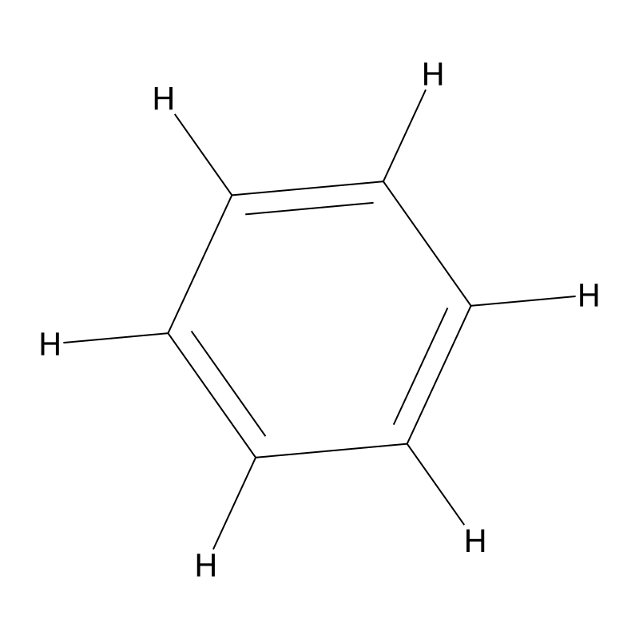

# RDKit Chemistry Analysis Skill

<div align="center">


**Molecular structure analysis and visualization using RDKit**

[Features](#features) • [Quick Start](#quick-start) • [Examples](#examples) • [Documentation](#documentation)

</div>

---

## Showcase: Benzene (C₆H₆) Visualization

### 🎨 2D Structure

<p align="center">
  
  
</p>

**Left**: Clean 2D representation  
**Right**: With explicit hydrogens

---

### 🔬 Charge Distribution (Gasteiger)

<p align="center">
  
</p>

**Color mapping**:
- 🔴 **Red** → Negative charge (C atoms: -0.062)
- ⚪ **White** → Neutral
- 🔵 **Blue** → Positive charge (H atoms: +0.062)

---

### 💠 Aromatic System

<p align="center">
  
</p>

**Aromatic ring** highlighted in blue

---

### 🧊 3D Structure (xyzrender)

<p align="center">
  
</p>

**Rendered with xyzrender** (transparent background, bond orders shown)

---

### 📊 Molecular Descriptors

```python
Molecular formula:  C6H6
Molecular weight:   78.11 Da
LogP:               1.69
TPSA:               0.00 Ų
H-bond donors:      0
H-bond acceptors:   0
Rotatable bonds:    0
Aromatic rings:     1
```

---

## Features

✅ **3D Conformer Generation**
- ETKDG algorithm
- MMFF94/UFF force field optimization
- Energy minimization

✅ **Molecular Descriptors**
- LogP, TPSA, molecular weight
- Hydrogen bonding (donors/acceptors)
- Rotatable bonds
- Aromatic ring detection

✅ **Charge Calculation**
- Gasteiger charges (empirical, fast)
- Mulliken charges (with PySCF)

✅ **Non-Covalent Interactions**
- π-π stacking analysis
- Hydrogen bond identification
- Donor-acceptor analysis (TADF)

✅ **Visualization**
- 2D structures with highlighting
- 3D rendering (xyzrender)
- Charge distribution maps
- Aromatic system visualization

✅ **Integration**
- PySCF for DFT calculations
- xyzrender for 3D visualization
- Multiwfn for wavefunction analysis

---

## Quick Start

### 1. Basic Molecular Analysis

```python
from rdkit import Chem
from rdkit.Chem import AllChem, Descriptors

# Build molecule
mol = Chem.MolFromSmiles("c1ccccc1")  # Benzene
mol = Chem.AddHs(mol)

# Generate 3D conformer
AllChem.EmbedMolecule(mol, AllChem.ETKDG())
AllChem.MMFFOptimizeMolecule(mol)

# Calculate descriptors
print(f"MW: {Descriptors.ExactMolWt(mol):.2f}")
print(f"LogP: {Descriptors.MolLogP(mol):.2f}")
print(f"TPSA: {Descriptors.TPSA(mol):.2f}")
```

### 2. Charge Calculation

```python
AllChem.ComputeGasteigerCharges(mol)

for atom in mol.GetAtoms():
    charge = float(atom.GetProp('_GasteigerCharge'))
    print(f"{atom.GetSymbol()}: {charge:.3f}")
```

### 3. Visualization

```python
from rdkit.Chem.Draw import rdMolDraw2D

# 2D structure
drawer = rdMolDraw2D.MolDraw2DCairo(800, 800)
drawer.DrawMolecule(mol)
drawer.FinishDrawing()
drawer.WriteDrawingText("molecule.png")
```

### 4. 3D Rendering (with xyzrender)

```python
# Export to SDF
writer = Chem.SDWriter("molecule.sdf")
writer.write(mol)
writer.close()

# Then in shell:
# xyzrender molecule.sdf -o molecule.png --transparent --bo
```

---

## Examples

See `examples/` directory:

- **`demo_molecule_opt.py`** - Conformer generation and optimization
- **`molecular_descriptors.py`** - Descriptor calculation and analysis
- **`nci_visualization.py`** - Non-covalent interaction analysis
- **`advanced_quantum_calc.py`** - Combining RDKit with PySCF
- **`benzene_showcase.py`** - Complete visualization showcase (this example)

---

## Installation

### Using conda (recommended)

```bash
conda install -c conda-forge rdkit
```

### Using pip

```bash
pip install rdkit
```

### Optional dependencies

```bash
# For DFT calculations
pip install pyscf

# For 3D visualization
pip install xyzrender
```

---

## Documentation

- **SKILL.md** - Complete skill documentation
- **README.md** - This file
- **examples/** - Example scripts

### Common Patterns

#### Pattern 1: Quick Analysis

```python
def analyze_molecule(smiles):
    mol = Chem.MolFromSmiles(smiles)
    mol = Chem.AddHs(mol)
    
    AllChem.EmbedMolecule(mol, AllChem.ETKDG())
    AllChem.MMFFOptimizeMolecule(mol)
    
    return {
        'MW': Descriptors.ExactMolWt(mol),
        'LogP': Descriptors.MolLogP(mol),
        'TPSA': Descriptors.TPSA(mol),
    }
```

#### Pattern 2: Batch Screening

```python
smiles_list = ["SMILES1", "SMILES2", "SMILES3"]

for smiles in smiles_list:
    mol = Chem.MolFromSmiles(smiles)
    # ... analysis
```

---

## Integration with Other Tools

### PySCF (DFT calculations)

```python
from pyscf import gto, dft

# Convert RDKit mol to PySCF format
coords = []
conf = mol.GetConformer()

for atom in mol.GetAtoms():
    pos = conf.GetAtomPosition(atom.GetIdx())
    coords.append(f"{atom.GetSymbol()} {pos.x:.6f} {pos.y:.6f} {pos.z:.6f}")

xyz = "\n".join(coords)
mol_pyscf = gto.M(atom=xyz, basis='6-31G')

mf = dft.RKS(mol_pyscf)
mf.xc = 'B3LYP'
mf.kernel()
```

### xyzrender (3D visualization)

```bash
xyzrender molecule.sdf -o molecule.png --transparent --bo
```

---

## Requirements

- Python >= 3.8
- RDKit >= 2023.03
- (Optional) PySCF >= 2.0
- (Optional) xyzrender >= 1.0

---

## License

MIT

---

## References

- RDKit Documentation: https://www.rdkit.org/docs/
- MMFF94 Paper: Halgren, J. Comput. Chem. 1996, 17, 490-519
- Gasteiger Charges: Gasteiger & Marsili, Tetrahedron 1980, 36, 3219-3228

---

<div align="center">

**Created by Silico (AI Agent)** 🔮

*Part of the [quantum-chem-skills](https://github.com/silico-quantum/quantum-chem-skills) collection*

</div>
